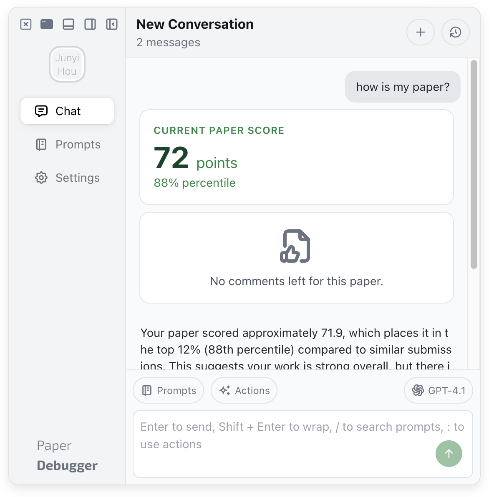
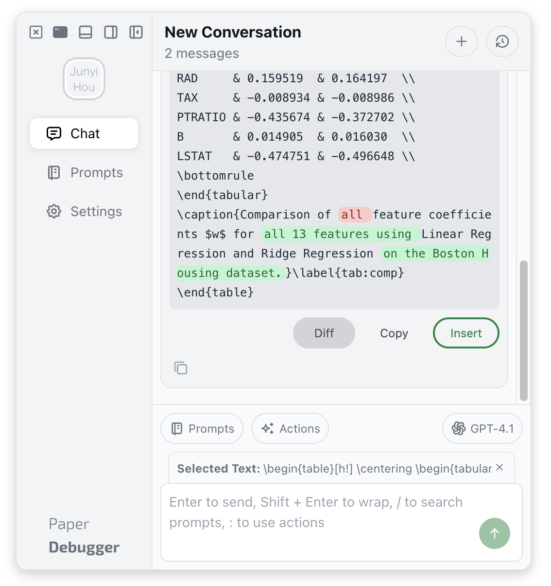
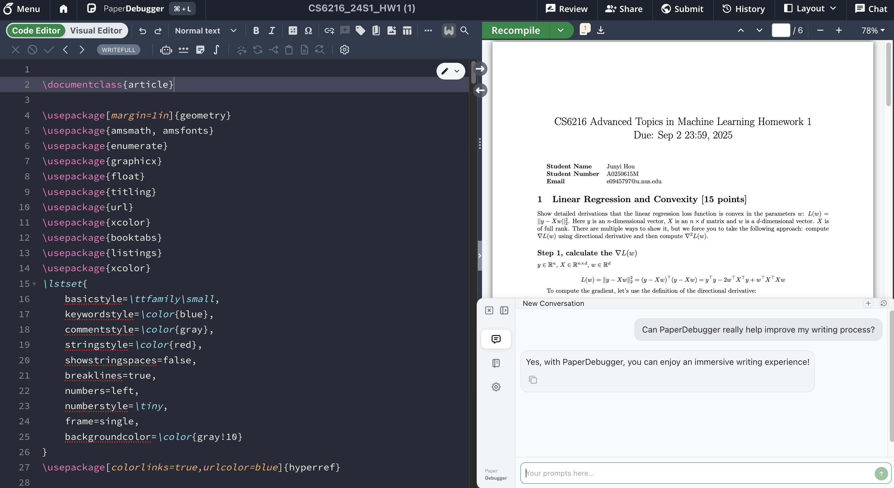
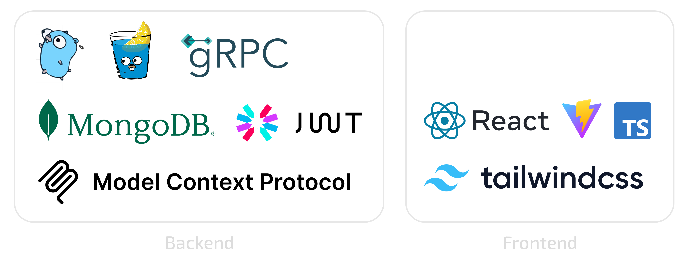

PaperDebugger is an AI-powered academic writing assistant that helps researchers debug and improve their LaTeX papers.

[**Install from Chrome Web Store**](https://chromewebstore.google.com/detail/paperdebugger/dfkedikhakpapbfcnbpmfhpklndgiaog) or [**Download Building Artifacts v2.9.8**](https://github.com/PaperDebugger/paperdebugger/actions/runs/17276722242/artifacts/3866902136)

<div align="center">
  
  
  
</div>

## Overview
The PaperDebugger backend is built with:



- **Language**:  Go 1.24+
- **Framework**:  Gin (HTTP) + gRPC (API)
- **Database**: MongoDB
- **AI Integration**: OpenAI API
- **Architecture**: Microservices with Protocol Buffers
- **Authentication**: JWT-based with OAuth support

## Features

PaperDebugger never modifies your project, it only reads and provides suggestions.

- **Chat**: AI-powered chats about your overleaf project
- **Instant Insert**: One-click, insert AI response to your project
- **Comment System**: Automatically generate comments and insert into your project
- **Prompt Library**: Custom prompt templates for different use cases

https://github.com/user-attachments/assets/6c20924d-1eb6-44d5-95b0-207bd08b718b


## Prerequisites

### System Requirements
- **Go**: 1.24 or higher
- **Node.js**: LTS version (for frontend build)
- **MongoDB**: 4.4 or higher
- **Git**: For cloning the repository

### Development Tools
- **Buf**: Protocol Buffer compiler
- **Wire**: Dependency injection code generator
- **Make**: Build automation

### Installation

#### On macOS/Linux (using Homebrew)
```bash
# Install Go
brew install go

# Install Buf (required for Protocol Buffers)
brew install bufbuild/buf/buf

# Install Node.js
brew install node
```

## Backend Build

### 1. Clone
```bash
# Clone the repository
git clone https://github.com/PaperDebugger/paperdebugger.git
cd paperdebugger
```

### 2. Start MongoDB
```bash
# Using Docker (recommended)
docker run -d --name mongodb -p 27017:27017 mongo:latest
```

### 3. Setting up environments

```bash
cp .env.example .env
# edit the .env file based on your condition
```

### 4. Build and Run

```bash
# Build the backend
make build
# Run the backend server
./dist/pd.exe
```

The server will start on `http://localhost:6060`.


## Frontend Extension Build

### Chrome Extension
```bash
cd webapp/_webapp

# Install frontend dependencies
npm install

# Build for production (connects to production server)
npm run build:prd:chrome

# The extension files will be in dist/
cd dist
zip -r paperdebugger-extension.zip *
```

### Installing the Extension
1. Open Chrome and navigate to `chrome://extensions/`
2. Enable "Developer mode"
3. Click "Load unpacked" and select the `webapp/_webapp/dist` directory, or drag the `paperdebugger-extension.zip` file into the extensions page

## Custom Endpoint Configuration

If you want to use a self-hosted PaperDebugger backend, you should set up a Custom Endpoint. Please note that you need to handle HTTPS serving yourself, as Chrome blocks HTTP requests from HTTPS websites for security reasons.

To configure a custom endpoint:
1. Open the PaperDebugger extension
2. Go to Settings, click `version number` 5 times to enable "Developer Tools"
3. Enter your backend URL in the "Backend Endpoint" field
4. Refresh the page

If you encounter endpoint errors after refresh, use the "Advanced Options" at the bottom of the login page to reconfigure the endpoint.
