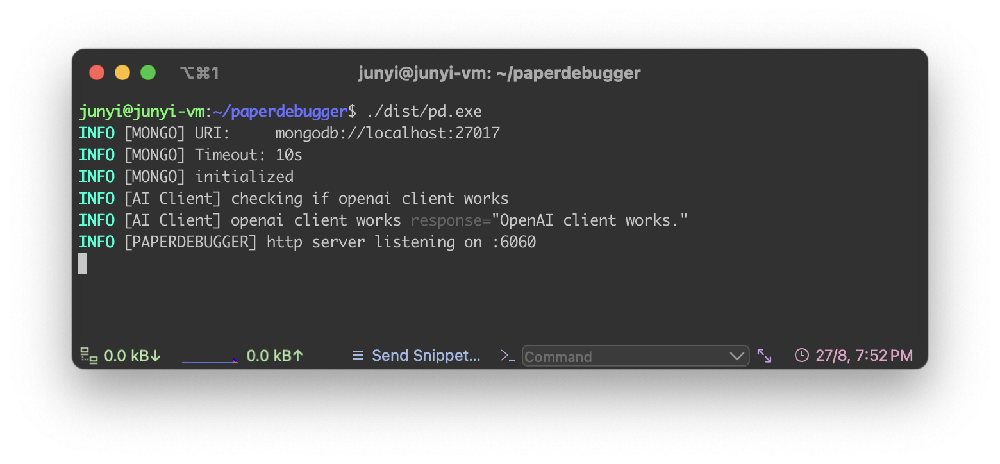

## 🛠️ Development Setup

### Prerequisites

#### System Requirements
- **Go**: 1.24 or higher
- **Node.js**: LTS version (for frontend build)
- **MongoDB**: 4.4 or higher
- **Git**: For cloning the repository

#### Development Tools
- **Buf**: Protocol Buffer compiler
- **Wire**: Dependency injection code generator
- **Make**: Build automation

#### Quick Installation (macOS/Linux with Homebrew)
```bash
# Install Go
brew install go

# Install Buf (required for Protocol Buffers)
brew install bufbuild/buf/buf

# Install Node.js
brew install node
```

### Backend Build

#### 1. Clone the Repository
```bash
git clone https://github.com/PaperDebugger/paperdebugger.git
cd paperdebugger
```

#### 2. Start MongoDB
```bash
# Using Docker (recommended)
docker run -d --name mongodb -p 27017:27017 mongo:latest
```

#### 3. Environment Configuration
```bash
cp .env.example .env
# Edit the .env file based on your configuration
```

#### 4. Custom MCP Backend Orchestration [OPTIONAL FOR LOCAL DEV]
Our enhanced orchestration backend, [**XtraMCP**](https://github.com/4ndrelim/academic-paper-mcp-server), is partially deployed in-production, with selected components enabled to **balance stability and operational cost** at this stage. It is still under active development and remains closed-source for now. 

To understand the backend orchestration logic and view the currently available and gated features, as well as planned capabilities, refer to [/demo/xtramcp/readme.md](./demo/xtramcp/readme.md).<br>
You can still self-host PaperDebugger without it; all core features (chat, formatting, edits, comments) work normally.

Connecting to XtraMCP unlocks:
- research-mode agents (with on-demand search for latest publications),  
- structured reviewer-style critique,  
- domain-specific revisions tailored for academic writing powered by [XtraGPT](https://huggingface.co/Xtra-Computing/XtraGPT-14B) models.

We plan to **open-source XtraMCP** once the API stabilizes for community use.


#### 5. Build and Run
```bash
# Build the backend
make build

# Run the backend server
./dist/pd.exe
```

The server will start on `http://localhost:6060`.

<div align="center">
  
</div>

**NOTE**: `"ERROR [AI Client] Failed to initialize XtraMCP session"` <br> is expected if you're hosting locally without XtraMCP or an equivalent MCP orchestration backend.

### Frontend Extension Build

#### Chrome Extension Development
```bash
cd webapp/_webapp

# Install frontend dependencies
npm install

# Build for production (connects to production server)
npm run build:prd:chrome

# Package the extension
cd dist
zip -r paperdebugger-extension.zip *
```

#### Installing the Development Extension
1. Open Chrome and navigate to `chrome://extensions/`
2. Enable "Developer mode" (toggle in top-right)
3. Click "Load unpacked" and select the `webapp/_webapp/dist` directory
   - Or drag the `paperdebugger-extension.zip` file into the extensions page
